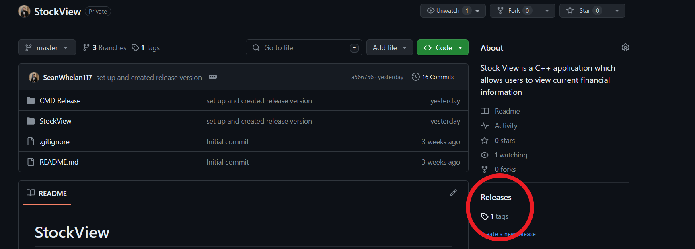
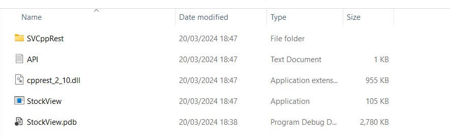
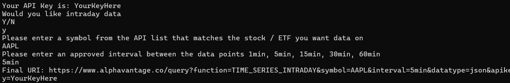

# StockView
StockView is a C++ application designed to provide users with access to financial information on a massive range of Stocks and ETFs using the AlphaVantageAPI. Currently the project has a simpler command line version that is usable and in the near future I will be adding IMGUI to give the users more options and an interface to view their required information.

## Features

- Retrieve stock and ETF information.
- Interact with the AlphaVantage API.
- Command-line interface for simple usage.

## Installation and Usage

### Command line version:

1: clone the project
  - Click tags on the main project page, download the source code zip and unzip the folder to a location of your choosing
  - 

2: Acquiring your API Key
  - Go to the Alpha Vantage website [here](https://www.alphavantage.co/support/#api-key)
  - Fill out your information for the free API key or alternatively pay for a premium key
  - Either way, save your API key and do not share it with anyone else
  - NOTE: The free API key entitles you to 25 queries a day.

3: Adding your API Key
  - Open the unzipped source code folder and naviage into the CMD Release folder
  - 
  - Open the text file entitled "API" and replace yourKeyHere with your actual key.
  - Verify the key is correct and you havent added any spaces before or after the key, or any other empty rows

4: Running the program and retrieving information
  - Run the application file entitled "StockView"
  - 
  - When asked to "Please enter a symbol from the API list that matches the stock / ETF you want data on" please do so.
  - You can find an up to date excel document with all the available stock and ETF symbols [here](https://www.alphavantage.co/query?function=LISTING_STATUS&apikey=demo)
      - Example: MSFT = Microsoft Corporation
      - Example: AAPL = Apple inc
  - When asked to "Please enter an approved interval between the data points 1min, 5min, 15min, 30min, 60min" please respond with one of those options
  - Once you're finished viewing your data press any character and ENTER/RETURN to exit.

###  GUI version:
  - Coming soon...
